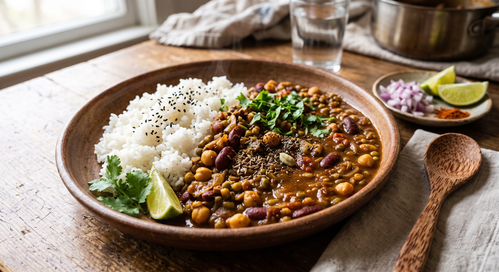

# 豆カレー１

ホールスパイスから作る、豆がたっぷり入ったシンプルなカレー。玉ねぎとトマトをしっかり炒めるのがポイント。

## 材料

### ホールスパイス

* カルダモン（2〜3粒）
* クミンシード

### パウダースパイス

* 市販のカレー粉またはお好みのパウダースパイス。

### 具材

* 玉ねぎ
* すりおろしニンニク
* すりおろし生姜
* トマト
* 茹で豆（お好みのもの）
* 水
* オリーブオイル
* 塩

---

## 作り方

### 1. ホールスパイスを炒める

1. 鍋にオリーブオイルをしく。
2. カルダモンとクミンシードを入れ、**弱火〜中火**で香りが立つまで炒める。

### 2. 玉ねぎを炒める

香りが立ったら玉ねぎを加え、**色づくまで**しっかり炒める。

### 3. すりおろしニンニクと生姜を炒める

すりおろしニンニクとすりおろし生姜を加え、**水分が飛ぶまで**炒める。

### 4. パウダースパイスを加える

パウダースパイスと塩を入れ、**玉ねぎと一体化するまで**炒める。スパイスはお好みで調整する。

### 5. トマトを炒める

トマトをカットして加え、水分を飛ばすように炒める。

### 6. 煮込む

1. 水を入れる。
2. 豆を加え、**10分ほど**煮込む。

### 7. 味を整えて盛り付ける

味見をして、塩やお好みの調味料で味を整える。皿にご飯とカレーを盛り付けて完成。
