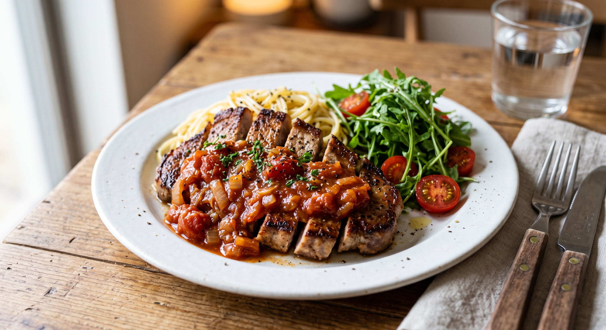

# ポークチャップ

トマトと玉ねぎを使った、少しフレッシュなポークチャップ。
パスタとルッコラを添えてワンプレートに。**2人分**。

## 材料

### ソース

* 玉ねぎ **1/2個**
* ニンニク **1片**
* トマト **1個**
* ケチャップ **大さじ2**
* ウスターソース **大さじ1**
* 塩 少々

### 豚肉

* ソテー用の豚肉 **2枚（1枚150g程度）**
* 塩 適量
* 粗挽き黒こしょう 適量

### 添え物

* パスタ **50g程度**
* オリーブオイル 適量
* ルッコラ 適量
* フルーツトマト 適量

---

## 作り方

### 1. 豚肉の下処理をする

1. ソテー用の豚肉の水分をキッチンペーパーで拭き取る。
2. 塩とこしょうを振り、**10分ほど**置く（この間に次のソース作りを進める）。

### 2. ソースを作る

1. 玉ねぎとニンニクをみじん切りにする。
2. トマトをくし切りにする。
3. フライパンで玉ねぎとニンニクを炒める。
4. 火が通ったら塩少々とトマトを加え、さらに炒める。
5. トマトがなじんできたらケチャップを加えて、トマトの形が崩れるまで炒める。
6. ウスターソースを加え、味を見て塩で調整する。

### 3. 添え物を準備する

1. パスタを茹でる。
2. 茹で上がったらお皿に盛り、オリーブオイルを絡める。
3. ルッコラを食べやすい大きさに切り、お皿に盛る。
4. フルーツトマトを食べやすい大きさに切り、お皿に盛る。

### 4. 豚肉を焼く

1. 出てきた水分をもう一度拭き取り胡椒をふる。
2. フライパンをしっかり熱し、豚肉を**中火〜強火**で焼く。

   * 目安は**厚さ1.5cmで片面2分ずつ程度**。
   * 焼き時間は豚肉の厚さに合わせて調整する。
3. 焼き上がったら取り出し、アルミホイルをかぶせて**2〜3分ほど**休ませる。
4. 空いたフライパンにソースを加えて軽く温め直し、焼き汁となじませる。
5. 休ませた豚肉を食べやすい大きさにカットする。

### 5. 盛り付ける

パスタの上に豚肉を盛り、ソースをたっぷりとかける。
